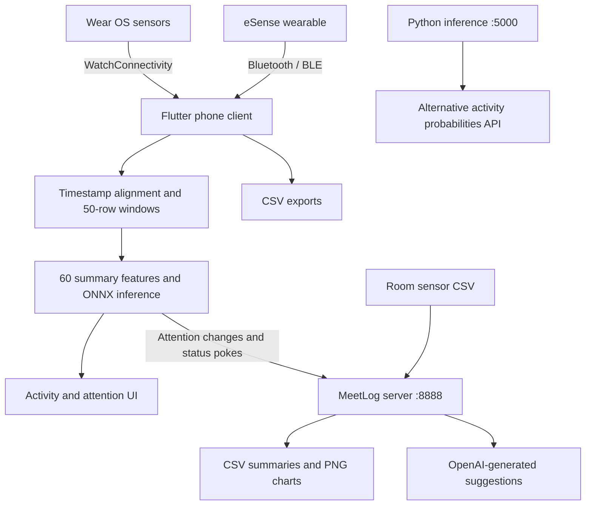

# DataCollection: Wearable Behaviour Recognition and MeetLog

This workspace contains Flutter phone and Wear OS apps, wearable sensor collection, on-device activity recognition, Python model experiments, and a meeting-attentiveness reporting server. Motion data from a smartwatch and an eSense wearable is aligned on the phone, classified locally, and summarized alongside room conditions by the server.

This guide describes the source in this checkout. Several dependency and integration issues remain; the setup commands below are a workflow, not a verified clean installation. See [Known limitations](#known-limitations).

## Contents

- [Project directory](#project-directory)
- [Architecture](#architecture)
- [Mobile applications](#mobile-applications)
- [Wear OS application](#wear-os-application)
- [MeetLog server](#meetlog-server)
- [Python inference and model projects](#python-inference-and-model-projects)
- [Connectivity packages and nested examples](#connectivity-packages-and-nested-examples)
- [Setup and operation](#setup-and-operation)
- [Data and model contracts](#data-and-model-contracts)
- [Validation and troubleshooting](#validation-and-troubleshooting)
- [Known limitations](#known-limitations)

## Project directory

| Path | Purpose | Entry point / configuration |
| --- | --- | --- |
| [app_client](app_client/) | Phone client with environment-based API configuration, local watch-connectivity plugin, collection, recognition, and meeting controls | `lib/main.dart`, `pubspec.yaml` |
| [nogitapp_client](nogitapp_client/) | Separate phone-client variant with hardcoded API URLs and the published watch-connectivity dependency | `lib/main.dart`, `pubspec.yaml` |
| [wear_OS](wear_OS/) | Watch app that sends sensor messages to the paired phone | `lib/main.dart`, `pubspec.yaml` |
| [MeetLog-Server](MeetLog-Server/) | Flask attention tracking, meeting coordination, room analysis, and reports | `app.py`, `requirements.txt` |
| [app_client/server](app_client/server/) | Standalone Flask/XGBoost inference, model artifacts, and notebooks | `app.py`, `model.py`, `modeldef.py` |
| [nogitapp_client/server](nogitapp_client/server/) | Corresponding inference-service and model-artifact copy | `app.py`, `model.py`, `modeldef.py` |
| [watch_connectivity](app_client/packages/watch_connectivity/) | Local Flutter wrapper around Android Wearable APIs and iOS WatchConnectivity | `lib/`, `android/`, `ios/`, `pubspec.yaml` |
| [watch_connectivity_platform_interface](app_client/packages/watch_connectivity_platform_interface/) | Shared Dart interface for the local connectivity plugin | `lib/watch_connectivity_platform_interface.dart` |
| [Connectivity example](app_client/packages/watch_connectivity/example/) | Plugin demonstration app, with a missing local Garmin dependency | `lib/main.dart`, `pubspec.yaml` |
| [wear_OS/android](wear_OS/android/) | Watch Android host that also contains a nested Flutter counter-demo project | Nested `pubspec.yaml`, `lib/main.dart`, `android/` |

```text
DataCollection/
|-- README.md
|-- app_client/                    # Nested Git checkout / gitlink
|   |-- lib/                       # Phone UI, collection, alignment, inference
|   |-- assets/                    # Images and ONNX model
|   |-- packages/                  # Connectivity libraries and example
|   |-- server/                    # Python inference and ML experiments
|   |-- plots/                     # Existing analysis artifacts
|   `-- android/, ios/, ...         # Flutter platform projects
|-- nogitapp_client/               # Separately stored phone-client variant
|   |-- lib/, assets/, server/
|   `-- android/, ios/, ...
|-- wear_OS/
|   |-- lib/                       # Actual watch app
|   `-- android/                   # Android host plus nested demo scaffold
`-- MeetLog-Server/
    |-- app.py
    |-- ambient_client.py
    |-- paramiko_fetch.py
    |-- attention_logs/
    |-- summary reports/           # Existing artifacts, with a space
    `-- sensor_data_log.csv
```

Platform folders are hosts for the Flutter apps, not additional independent products. Their presence does not establish full desktop, web, or iOS support. Editor configuration, generated build folders, and bundled virtual environments are development artifacts.

**Checkout caveat:** the parent Git index stores `app_client` as a gitlink, the root `.gitignore` lists it, and no root `.gitmodules` is present. A fresh parent-repository clone may lack its contents. Obtain the separate checkout from the maintainer if needed; standard submodule initialization cannot be assumed to restore it.

## Architecture



The main recognition path runs ONNX on the phone. The Python inference services are separate experimental alternatives, not prerequisites for local inference. MeetLog receives attention states or already-computed probabilities; its `/predict` route does not classify raw sensor windows.

## Mobile applications

### `app_client`

The phone UI is titled **Complex Behaviour Recognition** and contains four tabs:

| Tab | Responsibilities |
| --- | --- |
| Watch | Connection state, incoming smartwatch IMU values, CSV export, and graphs |
| Esense | Wearable connection, device controls, and sensor views |
| Prediction | Stream alignment, ONNX classification, probabilities, attention, and meeting controls |
| Combined | Combined sensor collection and buffered/unbuffered CSV exports |

| File / directory | Responsibility |
| --- | --- |
| `lib/main.dart` | Load `.env`, initialize Hive `myBox`, launch the UI, receive watch messages, export watch data |
| `lib/homescreen.dart` | Four-tab navigation |
| `lib/config/app_env.dart` | Environment-based endpoint URLs with source-defined LAN fallbacks |
| `lib/recog.dart` | Alignment, inference windows, ONNX execution, labels, meeting requests, report polling |
| `lib/prediction.dart` | Combined collection and CSV export |
| `lib/globals.dart` | Shared sensor data and state |
| `lib/esenseconnect.dart`, `lib/esense/` | eSense connectivity and device helpers |
| `lib/routes/` | Connection and calibration screens; exploratory notebook |
| `lib/graphs.dart`, `lib/esense_graph.dart` | Sensor charts |
| `lib/pongsense.dart`, `lib/math/` | Sensor-driven interaction and geometry helpers |
| `lib/util/loggingclient.dart` | HTTP logging wrapper |

Dependencies include Flutter, `flutter_blue_plus`, `esense_flutter`, local `watch_connectivity`, `sensors_plus`, `onnxruntime`, Hive, CSV/file helpers, charting, and `flutter_dotenv`. See [pubspec.yaml](app_client/pubspec.yaml) for full declarations and pinned Git dependencies.

### `nogitapp_client`

This separately stored client retains watch/eSense collection, graphs, calibration, combined exports, local recognition, and its own Python inference folder. It is not a dependency of `app_client`.

- It uses published `watch_connectivity: ^0.2.1+1` rather than the local plugin.
- It does not declare `flutter_dotenv`; API addresses are embedded in `lib/recog.dart`.
- Its assets, source, platform configuration, and model artifacts are independent copies. Changes do not automatically propagate between clients.

Use `app_client` for its configurable endpoints and local plugin work; use `nogitapp_client` when reproducing that variant. Both use Android application ID `com.example.wear_os`, so they cannot coexist as distinct apps on one phone without changing IDs.

## Wear OS application

[wear_OS/lib/main.dart](wear_OS/lib/main.dart) detects watch mode, displays connectivity and sensor readings, and wraps the watch UI in `AmbientMode`.

It requests accelerometer, user-accelerometer, gyroscope, and magnetometer samples every 100 ms. **Start background messaging** starts a 100 ms timer, targeting roughly 10 messages per second; actual delivery depends on hardware and connectivity.

```json
{
  "Timestamp": "2026-09-18T10:30:00.000",
  "accelerometer": {"x": 0.0, "y": 0.0, "z": 9.8},
  "gyroscope": {"x": 0.0, "y": 0.0, "z": 0.0},
  "magnetometer": {"x": 0.0, "y": 0.0, "z": 0.0}
}
```

The active sender uses `WatchConnectivity.sendMessage`. BLE-peripheral dependencies and status text exist, but the main implementation sends through watch connectivity. User-accelerometer values are displayed; the message uses the regular accelerometer. Initial readings may be null.

Run from `wear_OS`, not the nested counter-demo under `wear_OS/android`. `lib/homepage.dart` and `lib/widgets.dart` provide additional UI code.

## MeetLog server

[MeetLog-Server/app.py](MeetLog-Server/app.py) runs Flask on `0.0.0.0:8888`. Live participant counters and meeting coordination are held in Python dictionaries.

It provides attention counts, meeting start/end tracking, participant snapshots, individual and aggregate CSV summaries, PNG plots, and OpenAI-generated suggestions. Checkpoint reports trigger at 15, 35, 55, 75, 95, and 115 scans when all tracked users reach each threshold. Meeting-end ambient statistics use the latest 300 CSV rows.

The source-defined Meeting Productivity Score is `MPS = 0.8 × A + 0.2 × E`, where `A` is attention percentage and `E` is an environmental score. Scores of at least 60 are marked productive. These are application heuristics, not established measurements of human attention or productivity.

### API reference

POST bodies are JSON. `/predict` uses `UserID`; other participant routes use `user_id`.

| Method | Route | Request | Behaviour |
| --- | --- | --- | --- |
| POST | `/start_meeting` | `{"user_id":"participant-01"}` | Reset counters and register a participant |
| POST | `/attention` | `{"user_id":"participant-01","attention_status":"attentive"}` | Count a scan and update status; normal statuses are `attentive` and `distracted` |
| POST | `/attention_poke` | `{"user_id":"participant-01"}` | Count another scan using the stored status; unknown users receive 404 |
| POST | `/predict` | `{"UserID":"participant-01","probabilities":[...]}` | Require 12 numbers, take argmax, map to attention, and update counters |
| POST | `/end_meeting` | `{"user_id":"participant-01"}` | Generate statistics/suggestions/plots, save a snapshot, and reset live counters |
| GET | `/owner_summary` | No body | Generate aggregate reports and return users, productivity, and output paths |

`/end_meeting` returns attention percentage, room averages, productivity values, a `productive` flag, suggestion text, and a Base64 graph. When all expected participants finish, it also writes the final owner report from snapshots.

**Integration gap:** `app_client` calls `/live_report`, but the included server defines no such route. Periodic reports need a compatible implementation. Do not substitute `/end_meeting` for polling: it ends the participant session and resets counters. The repeated-status endpoint is `/attention_poke`, with an underscore.

### Ambient-data utilities

| Script | Operation | Required configuration |
| --- | --- | --- |
| `ambient_client.py` | One HTTP request for room data; append timestamped JSON to `ambient_logs.jsonl` | Actual `AMBIENT_SERVER_URL` |
| `paramiko_fetch.py` | Repeated SSH/SFTP CSV fetches with a five-second pause | Host, port, credentials, remote path, local destination |

Run these separately from Flask. The HTTP utility does not convert JSONL into the server's CSV input. Align the fetcher's local destination with `app.py`'s `LOCAL_FILE_PATH`; its checked-in destination is machine-specific. Its lowercase `timestamp` header check also differs from the declared `Timestamp` header, so inspect fetched CSVs before relying on it.

### Files and persistence

| Location | Contents |
| --- | --- |
| `sensor_data_log.csv` | Input room readings |
| `attention_logs/user_<user_id>_summary.csv` | Appended participant summaries |
| `summary_reports/` | Runtime reports and plots; created by the server |
| `summary reports/` | Existing artifacts in this checkout; a different directory |
| `ambient_logs.jsonl` | Optional HTTP ambient-client output |

Required ambient CSV columns:

```text
Timestamp,Temperature,Humidity,Light Intensity,Co2 Concentration,Door Status,Motion Status
```

Live meeting state is not restored from these files after restarting. There is no database-backed meeting persistence.

## Python inference and model projects

Both client `server/` directories contain standalone services. Their active Flask code loads `xgboost_activity_model.pkl` through `XGBWrapper` and listens on port **5000**.

| File / artifact | Purpose |
| --- | --- |
| `app.py` | Validate raw-window requests and return probabilities |
| `model.py` | Reshape 600 values into 50 × 12, compute column summaries, call `predict_proba` |
| `modeldef.py` | PyTorch `SensorLSTM` experiment definition |
| `xgboost_activity_model.pkl` | Active Python inference model |
| Other `xgboost_*.pkl`, `svm_activity_model.pkl`, `scaler.pkl` | Alternative model/scaler artifacts |
| `model_*.pt` | Saved PyTorch experiment artifacts |
| `convert.ipynb` | Model-related exploration; inspect cells and saved errors before reuse |
| `app_client/server/XGBoost.ipynb` | Data preparation, training, evaluation, and tuning with local dataset assumptions |
| Client `assets/xgb_model_prob.onnx` | Phone inference model |

The standalone API is `POST http://localhost:5000/predict`, with JSON key `data` containing exactly **600 numeric values**, flattened from 50 rows of 12 channels. It returns `{"probabilities":[...]}`. Wrong-length lists receive 400; model/preprocessing errors return 500.

This differs from MeetLog's port-8888 `/predict`, which accepts a 12-value probability vector. The model artifact present in `MeetLog-Server` is not loaded by its current `app.py`.

## Connectivity packages and nested examples

### Local libraries and plugin example

`app_client/packages/watch_connectivity` wraps native wearable communication and depends on sibling `watch_connectivity_platform_interface`. Keep both directories when copying the client. The interface is a library, not a standalone app; its example folder contains documentation.

The plugin includes Android/iOS implementations, a README, changelog, license, and demonstration app. The demonstration app's manifest references `../../watch_connectivity_garmin`, absent from this workspace. Restore or deliberately remove that example-only dependency before expecting dependency resolution to succeed.

### Nested Flutter demo

`wear_OS/android` contains both the actual watch Android host and a second Flutter project named `android`, with a counter-demo `lib/main.dart`, its own platform folders, and Dart constraint `^3.8.1`. It is not the sensor application. Review the overlapping Gradle layouts when diagnosing watch builds; its SDK constraint is separate from the watch manifest.

## Setup and operation

### Prerequisites

- Flutter/Dart, Android SDK tooling, and Git for Git-based dependencies.
- An Android phone, paired Wear OS watch, and eSense wearable for the full workflow. The checked-in Groovy app configurations set minimum SDK 23.
- Python and a fresh virtual environment for each service. No complete verified Python compatibility matrix is supplied.
- Phone-to-server network access on port 8888.
- Valid ambient CSV data and an `OPENAI_API_KEY` for complete meeting summaries.

**Resolve Flutter constraints first:** all three main Flutter manifests declare Dart `>=2.19.6 <3.0.0` alongside newer dependency declarations; `app_client` also uses newer Flutter APIs. Installing an old Dart SDK alone is not a reliable fix. Reconcile the SDK and dependencies, then resolve and validate that stack before following the build commands.

### 1. Start MeetLog

From the repository root in PowerShell:

```powershell
Set-Location MeetLog-Server
python -m venv .venv
.\.venv\Scripts\python.exe -m pip install -r requirements.txt
$env:OPENAI_API_KEY = '<your-api-key>'
.\.venv\Scripts\python.exe app.py
```

On Linux/macOS, use `.venv/bin/python` and `export OPENAI_API_KEY='<your-api-key>'`. Start from `MeetLog-Server` because data/output paths are relative. The OpenAI client is created at import time, so the key is required even when initially exercising only attention routes.

Requirements include Flask, NumPy, XGBoost, requests, websockets, pandas, OpenAI, Paramiko, and Matplotlib. They are unpinned; record a tested environment for reproducibility.

### 2. Configure the phone

Create or update `app_client/.env`, replacing `YOUR_SERVER_HOST` with a phone-reachable address:

```dotenv
API_URL_ATTENTION=http://YOUR_SERVER_HOST:8888/attention
API_URL_ATTENTION_POKE=http://YOUR_SERVER_HOST:8888/attention_poke
API_URL_START_MEETING=http://YOUR_SERVER_HOST:8888/start_meeting
API_URL_END_MEETING=http://YOUR_SERVER_HOST:8888/end_meeting
API_URL_LIVE_REPORT=http://YOUR_SERVER_HOST:8888/live_report
```

The last route is unsupported by the included server. Missing/blank individual entries fall back to source-defined LAN URLs, but the `.env` file must still exist because startup loads it as an asset. It is bundled into the app: store endpoints here, not server credentials or OpenAI keys.

For `nogitapp_client`, edit the URLs in `lib/recog.dart`. A physical phone's `localhost` refers to the phone, not the server computer.

### 3. Build phone and watch apps

Run each block from the repository root in separate terminals, after resolving manifest compatibility:

```powershell
Set-Location app_client
flutter doctor
flutter pub get
flutter devices
flutter run -d <phone-device-id>
```

```powershell
Set-Location wear_OS
flutter pub get
flutter devices
flutter run -d <watch-device-id>
```

Substitute `nogitapp_client` to build the other phone variant. After a working debug build, use `flutter build apk --release` from the selected app folder for an APK. Pairing, application identity, signing compatibility, and permissions must be consistent for watch messaging.

### 4. Run a session

1. Pair the watch and phone, enable Bluetooth, and grant requested permissions.
2. Open the watch app, refresh connection state, and start background messaging.
3. Confirm incoming accelerometer/gyroscope values in the phone's **Watch** tab.
4. Connect eSense through the **Esense** tab and verify readings; use calibration controls as appropriate.
5. Use **Combined** for collection/export or **Prediction** for recognition and meeting tracking.
6. Allow 50 aligned rows per prediction: roughly five seconds at 10 matched rows per second, longer with missing samples.
7. Check server requests for meeting start, attention changes, and repeated-state pokes. Live reports will fail until the missing endpoint is addressed.
8. End the meeting through the client, then inspect server `attention_logs/` and `summary_reports/` output.

### 5. Optional standalone inference

Run either client copy's service, not both on the same port:

```powershell
Set-Location app_client/server
python -m venv .venv
.\.venv\Scripts\python.exe -m pip install -r requirements.txt
# Active model dependencies are omitted from this requirements file.
.\.venv\Scripts\python.exe -m pip install xgboost scikit-learn
.\.venv\Scripts\python.exe app.py
```

The requirements pin Flask, Torch, and NumPy for older experiments. This set is unverified and may fail to resolve; reconcile pins with an available compatible environment before proceeding. Pickled models may need training-time package versions. Torch serves the LSTM experiments, not the active XGBoost path. Create a fresh environment rather than reusing bundled `venv` files.

For notebooks, install Jupyter and the packages imported by the selected notebook, configure dataset paths, and select the matching kernel. This workspace is not a complete reproducible training dataset.

## Data and model contracts

### Alignment and features

`app_client/lib/recog.dart` matches timestamped watch/eSense samples within **40 ms** and removes entries older than **two seconds** during alignment. Matched rows contain six watch accelerometer/gyroscope channels followed by six eSense values in the client's assembled order. Preserve exact channel ordering and units when changing models.

Every 50 matched rows produces five statistics per channel: **mean, standard deviation, minimum, maximum, median**. The result is 60 features passed to ONNX as `[1, 60]`.

The phone computes sample standard deviation (`n - 1`), while the Python wrapper uses NumPy's population standard deviation. Inputs are therefore not identical; reconcile preprocessing before comparing or replacing models.

### Labels and attention

| Index | Client activity label | Attention mapping |
| --- | --- | --- |
| 0 | Sitting + Typing on Desk | attentive |
| 1 | Sitting + Taking Notes | attentive |
| 2 | Standing + Writing on Whiteboard | attentive |
| 3 | Standing + Erasing Whiteboard | attentive |
| 4 | Sitting + Talking + Waving Hands | attentive |
| 5 | Standing + Talking + Waving Hands | attentive |
| 6 | Sitting + Drinking Water | attentive |
| 7 | Sitting + Drinking Coffee | distracted |
| 8 | Standing + Drinking Water | distracted |
| 9 | Standing + Drinking Coffee | distracted |
| 10 | Scrolling on Phone | distracted |

The client displays the most probable class only when its probability exceeds **0.5**; otherwise it displays `Transition` and retains its previous attention status. Changed attention goes to `/attention`; unchanged attention uses `/attention_poke` with the user ID.

Both attention mappings also include index 11 as distracted, and MeetLog expects 12 probabilities, but the client display list has 11 labels. Verify output dimensions and ordering: choosing class 11 could exceed the label list. The bundled model's output dimensions were not inspected for this guide.

### Local exports

Watch export writes `data.csv` under a `Download` folder in application external storage, with header:

```text
timestamp,gyro_x,gyro_y,gyro_z,acc_x,acc_y,acc_z
```

Combined collection uses `CombinedwBuffer<counter>.csv` and `CombinedwoBuffer<counter>.csv`, with code to copy CSVs into `/storage/emulated/0/Download`. Access depends on Android version and permissions. Inspect each export's header rather than assuming inference channel order.

## Validation and troubleshooting

After resolving dependencies, run `flutter analyze` and `flutter test` in each app being maintained. Existing tests include generated counter-app smoke tests that do not represent the wearable UI or validate Bluetooth/inference.

Against a running development MeetLog server:

```powershell
$baseUrl = 'http://localhost:8888'
Invoke-RestMethod -Method Post -Uri "$baseUrl/start_meeting" -ContentType 'application/json' -Body '{"user_id":"readme-smoke-test"}'
Invoke-RestMethod -Method Post -Uri "$baseUrl/attention" -ContentType 'application/json' -Body '{"user_id":"readme-smoke-test","attention_status":"attentive"}'
Invoke-RestMethod -Method Post -Uri "$baseUrl/attention_poke" -ContentType 'application/json' -Body '{"user_id":"readme-smoke-test"}'
```

Expected result: two total scans, both attentive. This registers a participant, so use a separate development process. Test meeting-end reports separately with valid ambient data and a key; that route can call the external suggestion service and reset counters.

| Symptom | Check |
| --- | --- |
| Dependency resolution fails | Dart constraints, Git availability, local package paths, Python pins |
| `app_client` missing after clone | Parent gitlink and absent `.gitmodules`; obtain the client checkout |
| Missing `.env` at startup | File exists in `app_client` and matches the asset declaration |
| Paired watch sends no data | Correct apps, reachability, identity/signing compatibility, messaging started |
| No eSense data | Device connection, permissions, device/calibration settings |
| Prediction window never fills | Both streams, valid timestamps, clock alignment, 40 ms tolerance, 50 matched rows |
| HTTP requests fail | Phone-reachable host, port, firewall, Android network configuration, route spelling |
| Live report returns 404 | Missing `/live_report` implementation |
| Poke returns 404 | Register user or send an initial attention state |
| Meeting-end fails | CSV path/schema/data, API key/connectivity, writable output directories |
| Python model fails to load | Working directory, artifact availability, matching runtime packages |
| Reports appear elsewhere | `summary_reports/` differs from `summary reports/` |

Hardware validation should cover both sensors, a complete prediction window, attention changes and pokes, exports, and a multi-participant meeting. No application builds, model execution, device tests, or external API calls were performed for this documentation update.

## Known limitations

- **Dependency drift:** main Flutter SDK constraints conflict with newer source/dependencies; Python inference requirements retain old pins and omit active model dependencies.
- **Contract gaps:** missing `/live_report`, inconsistent class counts, and different mobile/Python standard deviations.
- **In-memory state:** restarts lose live meeting counters; independent server workers would not share them.
- **Identity:** the phone uses device information through `globals.Model` as its user ID. Confirm uniqueness for participants with identical phone models.
- **Local configuration:** hardcoded LAN addresses, SSH credentials, and machine-specific paths remain. Configure the fetcher for your environment and move credentials out of source before sharing/deploying it.
- **Access and data handling:** Flask routes have no authentication layer. Handle sensor recordings, user summaries, logs, and external suggestion requests according to the study's consent and data-access requirements.
- **Reproducibility:** artifacts and notebooks do not establish current accuracy, latency, memory consumption, or a complete training pipeline. Measure those properties on the selected devices and dataset.
- **Licensing:** bundled connectivity packages include licenses; no root-level license is present. Consult the maintainer before redistributing the overall project.
